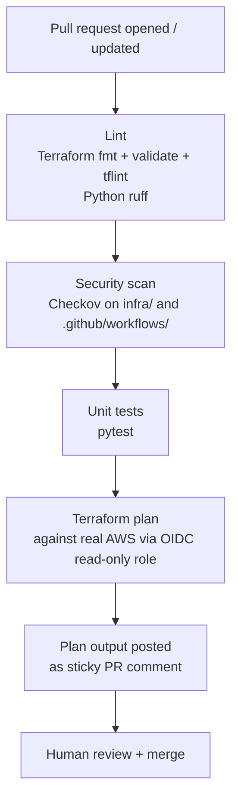
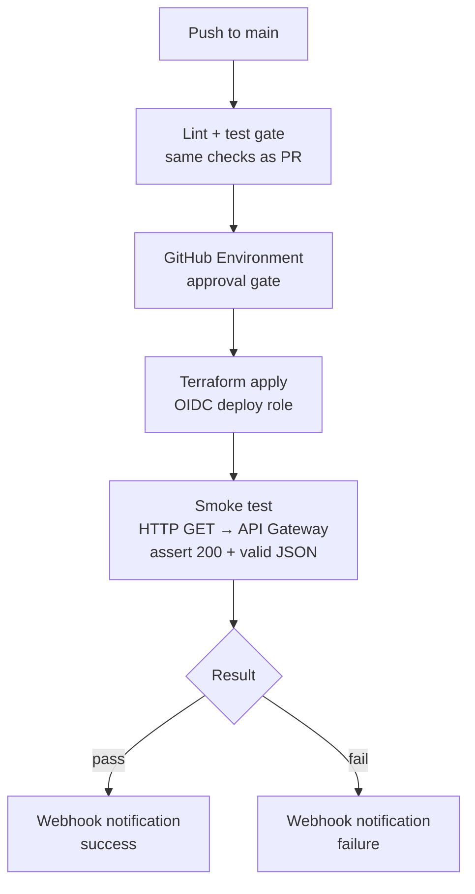

# aws-cicd-reference

A reference GitHub Actions pipeline for deploying to AWS. The application
(a Lambda function behind API Gateway) is intentionally trivial — the point
is the pipeline: what it enforces, why each gate exists, and how to extend
it for a real organisation.

If you fork this and find something that doesn't work or a pattern you'd
argue against, open an issue.

---

## What this demonstrates

A CI/CD pipeline for AWS that a platform team would actually be willing to
mandate across engineering teams: short feedback loops on pull requests,
OIDC authentication with no long-lived credentials, hard-fail security
scanning, Terraform plan output posted directly to the PR, and an
environment-gated deploy with a post-deploy smoke test. The entire pipeline
is expressed in ~300 lines of YAML. The goal is to show that production-grade
guardrails don't require complexity.

---

## Architecture

### PR validation flow



### Deploy flow



---

## What this pipeline enforces

| Gate | Why |
|---|---|
| `terraform fmt -check` | Formatting drift causes noisy diffs and hides real changes. Enforced in CI so it can't be skipped. |
| `terraform validate` | Catches syntax errors and type mismatches before a plan is attempted. |
| tflint | Provider-specific rules that `validate` misses: deprecated arguments, invalid AMI references, missing required tags. |
| Checkov | Policy-as-code scan covering ~1,000 Terraform rules and GitHub Actions workflow rules (misconfigured permissions, missing `pin-actions`). Hard-fails — warnings that can be ignored are not enforced. |
| Python ruff | Linting and formatting in one tool. Fails on style violations so code review can focus on logic. |
| pytest | Unit tests run before any infrastructure change is planned. A broken test blocks the plan, not just the deploy. |
| Terraform plan on PR | Reviewers see the exact resource diff before approving, not after. Eliminates "I didn't realise that would delete the table" incidents. |
| GitHub Environment approval | Adds a human gate between `terraform apply` and production. Auditable: approval is recorded in the Actions UI. Branch protection alone doesn't prevent a direct push from triggering a deploy. |
| Post-deploy smoke test | Asserts the deployed endpoint returns a valid response. Catches cases where `apply` succeeds but the application is broken (missing env var, bad IAM policy, etc.). |
| OIDC authentication | No long-lived AWS credentials in GitHub Secrets. Credentials are short-lived (1 hour) and scoped to the minimum required permissions for each workflow stage. |
| SHA-pinned actions | See design decisions below. |

---

## Quickstart

### Prerequisites

- AWS account with admin access to bootstrap the OIDC role and state backend
- GitHub repository (fork this one)
- Terraform >= 1.7 and the AWS CLI installed locally
- `jq` and `curl` for the bootstrap script

### 1. Bootstrap AWS

```bash
export AWS_REGION=us-east-1
export GITHUB_ORG=your-github-username
export GITHUB_REPO=aws-cicd-reference

bash scripts/bootstrap-oidc.sh
```

The script creates:
- S3 bucket for Terraform state (`tfstate-{account-id}-{region}`)
- DynamoDB table for state locking (`terraform-state-lock`)
- OIDC identity provider for `token.actions.githubusercontent.com`
- IAM role `github-actions-plan` (read-only, used by PR workflow)
- IAM role `github-actions-deploy` (read-write, used by deploy workflow)

It prints the role ARNs and backend config at the end.

### 2. Configure GitHub

In your fork, go to **Settings → Secrets and variables → Actions** and add:

| Secret | Value |
|---|---|
| `AWS_PLAN_ROLE_ARN` | ARN of `github-actions-plan` (from bootstrap output) |
| `AWS_DEPLOY_ROLE_ARN` | ARN of `github-actions-deploy` (from bootstrap output) |
| `TF_STATE_BUCKET` | S3 bucket name (from bootstrap output) |
| `NOTIFY_WEBHOOK_URL` | Slack incoming webhook URL (see Slack setup below) |

Go to **Settings → Environments**, create an environment named `production`,
and add at least one required reviewer.

### 3. Update the backend config

Edit `infra/versions.tf` and replace the backend bucket placeholder with your
bucket name, or let the workflow inject it via `-backend-config`.

### 4. Push a change

Open a pull request. The PR workflow runs automatically. Review the Terraform
plan posted as a comment. Merge. The deploy workflow runs, pauses for approval,
applies, and smoke-tests the endpoint.

### Wiring Slack notifications

1. Create an incoming webhook in your Slack workspace (Apps → Incoming Webhooks)
2. Add the webhook URL as the `NOTIFY_WEBHOOK_URL` repository secret
3. The deploy workflow posts a message on both success and failure

---

## Design decisions and trade-offs

### OIDC vs. long-lived access keys

Long-lived IAM access keys stored as GitHub Secrets have three problems: they
don't expire (a leaked key from a year-old CI run is still valid), rotating
them requires coordinating a secret update with a deployment, and there is no
audit trail of which workflow run used the key.

OIDC eliminates all three. GitHub mints a short-lived OIDC token per workflow
run; AWS STS exchanges it for temporary credentials valid for one hour. If the
credentials leak, they expire. There is nothing to rotate. CloudTrail records
which GitHub Actions run (`sub` claim) made each API call.

The IAM trust policy:

```json
{
  "Effect": "Allow",
  "Principal": {
    "Federated": "arn:aws:iam::ACCOUNT_ID:oidc-provider/token.actions.githubusercontent.com"
  },
  "Action": "sts:AssumeRoleWithWebIdentity",
  "Condition": {
    "StringEquals": {
      "token.actions.githubusercontent.com:aud": "sts.amazonaws.com"
    },
    "StringLike": {
      "token.actions.githubusercontent.com:sub": "repo:ORG/REPO:*"
    }
  }
}
```

The `sub` condition scopes the role to your repository. The deploy role
further restricts to `ref:refs/heads/main` so only pushes to main can assume
it, not PRs.

### SHA-pinned actions

Pinning to a mutable tag (`uses: actions/checkout@v4`) means your pipeline
silently runs whatever code the tag points to on the day it runs. Tag
reassignment is possible — an attacker who compromises a popular action's
maintainer account can move a tag to malicious code. The `tj-actions/changed-files`
supply chain incident (March 2025) is the most recent example: a compromised
action started exfiltrating secrets from pipelines that had been running safely
for months.

Pinning to a commit SHA (`uses: actions/checkout@11bd71901bbe5b1630ceea73d27597364c9af683`)
means your pipeline runs exactly the code you reviewed. To update, you
explicitly change the SHA, which produces a diff that can be reviewed.

Use [Dependabot for GitHub Actions](https://docs.github.com/en/code-security/dependabot/working-with-dependabot/keeping-your-actions-up-to-date-with-dependabot)
to get automated PRs when action SHA updates are available.

### Checkov over tfsec

tfsec is fast and has good coverage of core AWS resources. Checkov covers the
same ground plus GitHub Actions YAML (misconfigured `permissions`, workflows
that write to PRs without `pull-request: write`, etc.) and has a larger
community rule set. The performance difference is negligible for a repo this
size. The main trade-off: Checkov has more false positives and requires more
`checkov:skip` annotations on intentional deviations. Those annotations are
also documentation — they record why a rule was skipped.

### Separate PR and deploy workflows vs. one mega-workflow

A single workflow with conditional `if: github.event_name == 'push'` steps is
tempting. The problem: it obscures what runs when, makes the `needs:` graph
harder to reason about, and means a deploy failure produces a red checkmark
on your PR. Separate workflows keep concerns separate: PR authors see PR
feedback, deploy operators see deploy feedback.

The downside is duplication — both workflows run lint and tests. This is
addressed with a reusable workflow (`.github/workflows/_lint-test.yml`) that
both call. The duplication visible in each workflow file is now just a single
`uses:` line.

### GitHub Environments for the approval gate

Branch protection rules prevent merging without review, but they don't gate
what happens after merge. A push to `main` triggers the deploy workflow
immediately unless there is an environment protection rule in front of the
apply step. GitHub Environments add a required-reviewer gate that appears in
the Actions UI, records who approved and when, and can be scoped to specific
branches. The approval record is auditable; a Slack approval or an informal
"go ahead" in a PR comment is not.

---

## What's missing for true production

**Multi-environment promotion.** This pipeline deploys to one environment.
A real pipeline has dev, staging, and prod, with automated promotion gated
on tests passing in each stage. The pattern is reusable workflows called
three times with different input variables, not three copies of the workflow.

**Automated rollback.** If the smoke test fails, the pipeline posts a failure
notification but does not roll back. Automated rollback requires either
re-applying the previous Terraform state (complex, stateful) or a blue/green
or canary strategy where the old version is still running and traffic can be
shifted back. Neither is trivial to implement correctly; both are worth the
investment in production.

**Canary or blue/green deploy.** Lambda has built-in traffic shifting via
aliases and weighted routing. This pipeline deploys the new version and cuts
over immediately. A canary deploy would shift 10% of traffic to the new
version, run the smoke test, and shift the remaining 90% only on success.
AWS CodeDeploy for Lambda handles this, but it adds a dependency this pipeline
doesn't have.

**Drift detection.** Terraform state can diverge from actual AWS resources
through console changes, manual CLI operations, or resource replacement events
outside Terraform. This pipeline does not run scheduled `terraform plan` to
detect drift. A real implementation runs a plan on a nightly cron, checks the
exit code, and pages if the plan is non-empty.

**Single-account assumption.** The IAM role, the S3 backend, and the deployed
resources all live in the same AWS account. A production setup separates the
Terraform state account, the tooling account (where the OIDC role lives), and
the workload accounts.

---

## How this scales

**Multi-team, multi-account.** With AWS Organizations, each team gets its own
AWS account. The OIDC provider and the plan/deploy roles are provisioned into
each account by the platform team's account-vending automation (AFT or a
custom Terraform module). Each team's repo trusts its own account's role; there
is no shared deploy role.

**Centralised reusable workflows.** Move the `_lint-test.yml` reusable
workflow to a central `platform/github-workflows` repository. Teams reference
it with `uses: platform/github-workflows/.github/workflows/lint-test.yml@main`.
The platform team owns the quality gates; teams can't bypass them by forking
the workflow.

**Policy-as-code at the org level.** Checkov policies can be centralised in a
custom policy repository and referenced from each team's workflow. A new
security rule is added once and enforced across all repos on the next run.

**Terraform at scale.** Replace the single `infra/` directory with separate
state per environment and per logical component (networking, compute, IAM).
Use Atlantis or Terraform Cloud for per-PR plan locks and serialised applies
across teams working on shared infrastructure.

---

## Tested with

| Tool | Version |
|---|---|
| Terraform | `>= 1.7` |
| AWS provider | `>= 5.40` |
| Python | `3.12` |
| Checkov | `>= 3.2` |
| tflint | `>= 0.50` |
| ruff | `>= 0.9` |
| GitHub Actions runner | `ubuntu-latest` (24.04) |
